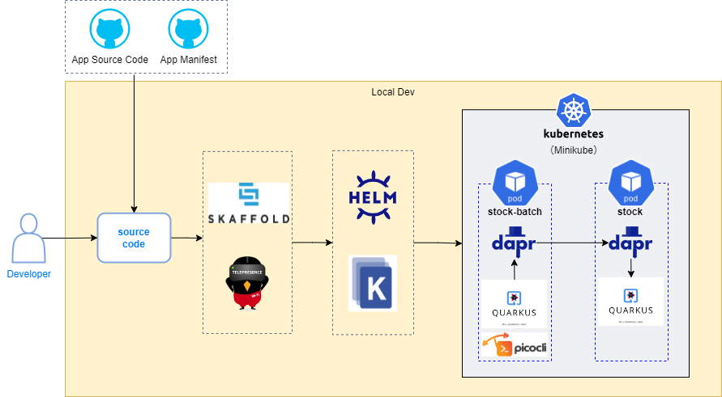

# nautible-app-ms-stock-batch project
このドキュメントには在庫(バッチ)アプリケーションについて記載する。
アプリケーション共通の内容については[こちら](https://github.com/nautible/docs/blob/main/referenceapp-architecture/README.md)を参照。
Quarkusアプリケーション共通の内容については[こちら](https://github.com/nautible/docs/blob/main/reference/quarkus/README.md)を参照。

## アプリケーションの主要アーキテクチャ
* [Java11](https://www.oracle.com/java/)
* [Quarkus](https://quarkus.io/)
* [quarkus-picocli](https://quarkus.io/guides/picocli)
* [picocli](https://picocli.info/)
* [dapr(service invocation)](https://dapr.io/)
* [Maven](https://maven.apache.org/)
* [Kubernetes](https://kubernetes.io/)
* [Docker](https://www.docker.com/)
* [AWS](https://aws.amazon.com/)
* [Azure](https://azure.microsoft.com/)
* [Kubernetes Job (ローカル環境)](https://kubernetes.io/docs/concepts/workloads/controllers/job/)
* [Argo Workflows (開発環境)](https://argoproj.github.io/argo-workflows/)

## ローカル環境での代替
* ローカル環境では開発容易性の観点から Argo Workflows を導入せず、通常の Kubernetes Job で動作させる。

|  開発環境(AWS/Azure)  |  ローカル環境  | 備考 |
| ---- | ---- | ---- |
| Argo Workflows | Kubernetes Job |  |

## ローカル環境での開発方法
### ローカル開発イメージ図


### 事前準備
* [dockerのインストール](https://docs.docker.com/get-docker/)
* [minikubeのインストール](https://kubernetes.io/ja/docs/tasks/tools/install-minikube/)
* [kubectlのインストール](https://kubernetes.io/ja/docs/tasks/tools/install-kubectl/)（接続先の設定をminikubeにする）
* [skaffoldのインストール](https://skaffold.dev/docs/install/)
* [daprのインストール(helm)](https://docs.dapr.io/getting-started/install-dapr-kubernetes/#install-with-helm-advanced)
* マニフェストファイルの配置
  * [nautible-app-ms-stock-batch-manifest](https://github.com/nautible/nautible-app-ms-stock-batch-manifest) を nautible-app-ms-stock-batch プロジェクトと同一階層に配置する(git clone)。
* [在庫アプリケーションの起動](https://github.com/nautible/nautible-app-ms-stock)

## サンプルアプリ利用手順

### ローカル環境
* ローカル環境では kubernetes job としてアプリケーションが即時に実行される。

#### skaffoldによるアプリケーション起動

```bash
skaffold dev --profile=(aws|azure)
```
※wslなどのLinux環境で実行することを前提としています

### 開発環境(AWS/Azure) 
* 開発環境では Argo Workflows 経由でアプリケーションを実行する。
  * マニフェストでは、Argo Workflows に本アプリケーションを実行するワークフローテンプレートと実行条件イベントが登録する処理が行われる。
  * RestAPI で Argo Workflows にイベント送信することで、登録したワークフローテンプレートが起動し、アプリケーションが実行される。

#### イベント送信によるアプリケーション起動

```bash
kubectl -n argowf port-forward deployment/argo-workflows-server 2746:2746

ARGO_TOKEN="Bearer $(kubectl get secret argowf-restapi-sa-token -n nautible-app-ms -o=jsonpath='{.data.token}' | base64 --decode)"

curl --request POST --insecure --url http://localhost:2746/api/v1/events/nautible-app-ms/nautible-app-ms-stock-batch-quantity-check -H "Authorization: $ARGO_TOKEN" -H 'Content-Type: application/json' -H "X-Argo-E2E: true" -d '{"message": "exec nautible-app-ms-stock-batch-quantity-check from events"}'
```